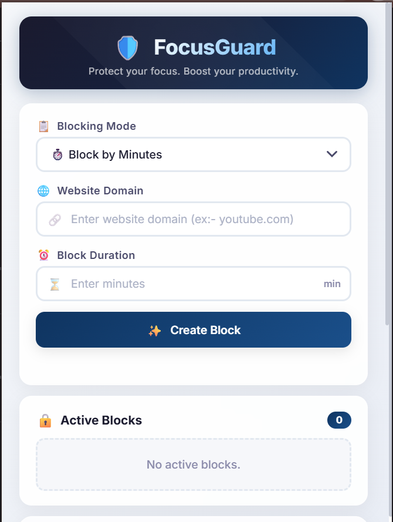
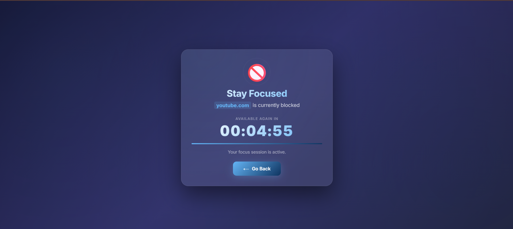
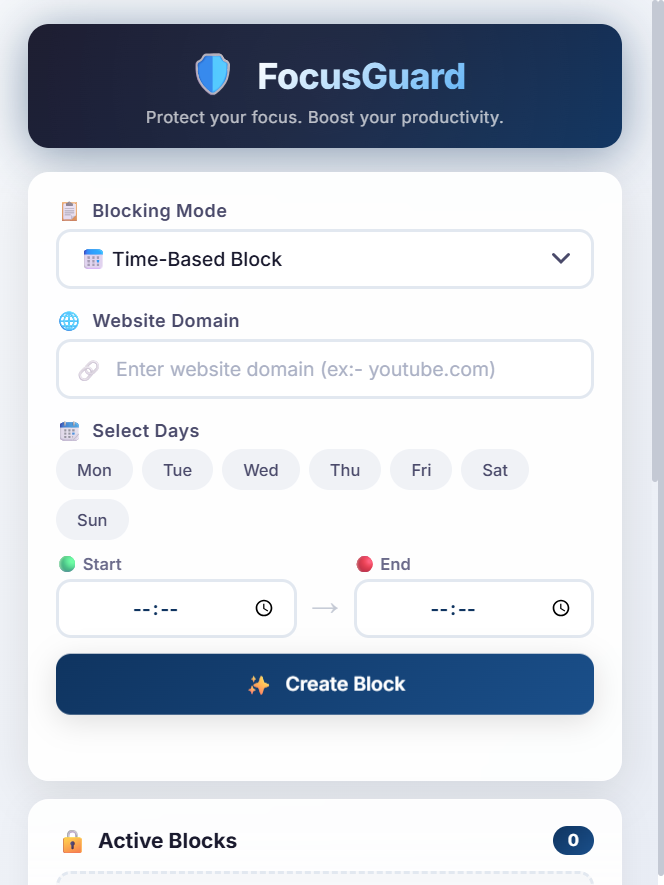
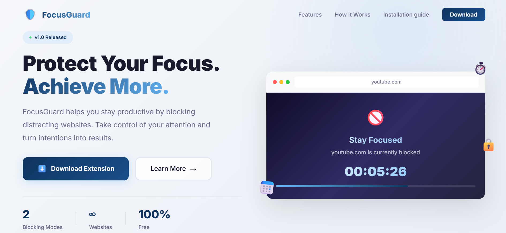

# FocusGuard - Protect Your Focus, Achieve More

[](https://github.com/yourusername/focusguard/releases)
[](LICENSE)
[](https://www.google.com/chrome/)
[](http://makeapullrequest.com)

> **A powerful Chrome extension that helps you stay productive by blocking distracting websites. Turn your intentions into results.**

---

## 🚀 Quick Links

- [Features](#-features)
- [Installation](#-installation)
- [How It Works](#-how-it-works)
- [Screenshots](#-screenshots)
- [Tech Stack](#-tech-stack)
- [Project Structure](#-project-structure)
- [Contributing](#-contributing)
- [License](#-license)

---

## 📸 Screenshots

<div align="center">
  
  
  <br/>
  
  
</div>

---

## ✨ Features

### ⏱️ Block by Minutes
- Set a timer and block distracting websites instantly
- Live countdown on blocked page
- Auto-unblock when time expires

### 📅 Time-Based Block
- Create recurring schedules for focus hours
- Select specific days of the week
- Custom start & end times
- Supports overnight schedules (e.g., 23:00 → 02:00)

### 🛡️ Smart Blocking
- Clean, motivating blocked page
- Shows schedule information for scheduled blocks
- Countdown timer for temporary blocks

### 💾 Persistent & Reliable
- Storage persistence across browser restarts
- Automatic recovery on startup
- Alarm-based scheduling

### 🔒 Privacy First
- **100% local storage** - No data collection
- **No tracking** - No analytics
- **Works offline** - No internet required

---

## 📦 Installation

### Method 1: Download from Website
1. Download the extension ZIP file
2. Extract the ZIP to a folder
3. Open Chrome and go to `chrome://extensions/`
4. Enable **Developer Mode** (top-right corner)
5. Click **"Load unpacked"**
6. Select the extracted folder
7. ✅ Done! Pin the icon for quick access

### Method 2: From Source
```bash
# Clone the repository
git clone https://github.com/yourusername/focusguard.git

# Navigate to the directory
cd focusguard

# Load in Chrome
# Open chrome://extensions/ → Developer Mode → Load unpacked
```

---

## 🎯 How It Works

```
User adds distracting website
         ↓
Choose blocking mode
         ↓
    ┌────┴────┐
    │         │
Temporary   Scheduled
    │         │
Set timer  Set schedule
    │         │
    └────┬────┘
         ↓
  Website blocked
         ↓
  Redirect to focus page
         ↓
   User stays focused!
```
---

## 🌐 Browser Support

| Browser | Support | Status |
|---------|---------|--------|
| Chrome | ✅ Full | Active |
| Edge | ✅ Full | Active |
| Brave | ✅ Full | Active |
| Opera | ✅ Full | Active |
| Firefox | ⚠️ Planned | Future |
| Safari | ❌ Not Planned | - |

> **Note:** FocusGuard currently works on all Chromium-based browsers. Firefox support is planned for a future release.

---

## 🛠️ Tech Stack

### Extension
- **Manifest V3** - Chrome extension architecture
- **JavaScript** - Core logic
- **Chrome APIs** - Storage, Alarms, DeclarativeNetRequest

### Website
- **HTML/CSS** - Landing page
- **JavaScript** - Interactivity
- **Vercel** - Hosting

---

## 📁 Project Structure

```
FocusGuard/
├── background/
│   └── service-worker.js      # Core blocking logic
├── blocked/
│   ├── blocked.html           # Blocked page
│   ├── blocked.css
│   └── blocked.js             # Countdown logic
├── utils/
│   ├── domain.js              # Domain validation
│   ├── schedule.js            # Schedule validation
│   └── schedule-engine.js     # Schedule logic
├── popup.html                 # Extension popup
├── popup.css
├── popup.js                   # UI logic
├── manifest.json              # Extension config
└── website/                   # Landing page
    ├── index.html
    ├── style.css
    └── downloads/
        └── focusguard-v1.0.0.zip
```

---

## 🤝 Contributing

Contributions are welcome! Here's how you can help:

### 🐛 Report Bugs
- Open an issue describing the bug
- Include steps to reproduce

### 💡 Suggest Features
- Open an issue with your feature idea
- Explain the use case

### 🔧 Submit Pull Requests
1. Fork the repository
2. Create your feature branch (`git checkout -b feature/AmazingFeature`)
3. Commit your changes (`git commit -m 'Add some AmazingFeature'`)
4. Push to the branch (`git push origin feature/AmazingFeature`)
5. Open a Pull Request

### 📝 Improve Documentation
- Fix typos
- Add examples
- Improve clarity

---

## 🗺️ Roadmap

### ✅ v1.0.0 (Current)
- [x] Temporary blocking by minutes
- [x] Scheduled blocking
- [x] Blocked page with countdown
- [x] Popup management
- [x] Storage persistence

### 🚀 v1.1.0 (Coming Soon)
- [ ] Focus Analytics Dashboard
- [ ] Focus Goals & Streaks
- [ ] Pomodoro Timer Integration
- [ ] Strict Focus Mode

### 🌟 v2.0.0 (Planned)
- [ ] AI Smart Recommendations
- [ ] Cloud Sync Across Devices
- [ ] Mobile App Support
- [ ] Advanced Insights

---

## 📄 License

This project is licensed under the MIT License - see the [LICENSE](LICENSE) file for details.

```
MIT License

Copyright (c) 2026 FocusGuard

Permission is hereby granted, free of charge, to any person obtaining a copy
of this software and associated documentation files (the "Software"), to deal
in the Software without restriction...
```

---

## 🙏 Acknowledgments

- Built with ❤️ for students, developers, and professionals
- Inspired by the need for better digital discipline
- Thanks to all contributors and users

---

## 📬 Contact

- **Website**: [focusguard.vercel.app](https://focusguard.vercel.app)
- **GitHub**: [github.com/yourusername/focusguard](https://github.com/yourusername/focusguard)
- **Email**: your.email@example.com

---

## ⭐ Star History

If you find this project useful, please give it a ⭐ on GitHub!

[](https://star-history.com/#yourusername/focusguard&Date)

---

<div align="center">
  <h3>Protect Your Focus. Achieve More. 🚀</h3>
  <p>Made with ❤️ for the open source community</p>
</div>
```

---

## 📝 Additional Files You Should Add

### LICENSE
```text
MIT License

Copyright (c) 2026 FocusGuard

Permission is hereby granted, free of charge, to any person obtaining a copy
of this software and associated documentation files (the "Software"), to deal
in the Software without restriction, including without limitation the rights
to use, copy, modify, merge, publish, distribute, sublicense, and/or sell
copies of the Software, and to permit persons to whom the Software is
furnished to do so, subject to the following conditions:

The above copyright notice and this permission notice shall be included in all
copies or substantial portions of the Software.

THE SOFTWARE IS PROVIDED "AS IS", WITHOUT WARRANTY OF ANY KIND, EXPRESS OR
IMPLIED, INCLUDING BUT NOT LIMITED TO THE WARRANTIES OF MERCHANTABILITY,
FITNESS FOR A PARTICULAR PURPOSE AND NONINFRINGEMENT. IN NO EVENT SHALL THE
AUTHORS OR COPYRIGHT HOLDERS BE LIABLE FOR ANY CLAIM, DAMAGES OR OTHER
LIABILITY, WHETHER IN AN ACTION OF CONTRACT, TORT OR OTHERWISE, ARISING FROM,
OUT OF OR IN CONNECTION WITH THE SOFTWARE OR THE USE OR OTHER DEALINGS IN THE
SOFTWARE.
```

### CONTRIBUTING.md
```text
# Contributing to FocusGuard

We love your input! We want to make contributing to FocusGuard as easy and transparent as possible.

## Ways to Contribute

- Report bugs
- Suggest features
- Submit pull requests
- Improve documentation

## Development Process

1. Fork the repo
2. Create a feature branch
3. Make your changes
4. Test thoroughly
5. Submit a pull request

## Pull Request Guidelines

- Update the README.md if needed
- Add comments to your code
- Test the extension thoroughly
- Follow existing code style

## Code of Conduct

Be respectful and inclusive. Help us build a welcoming community.
```